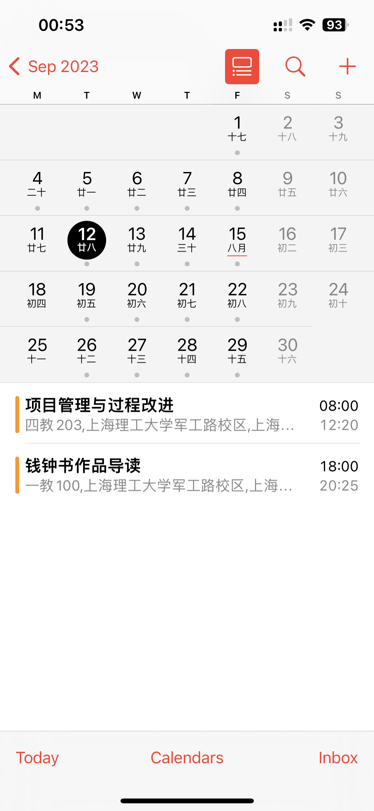
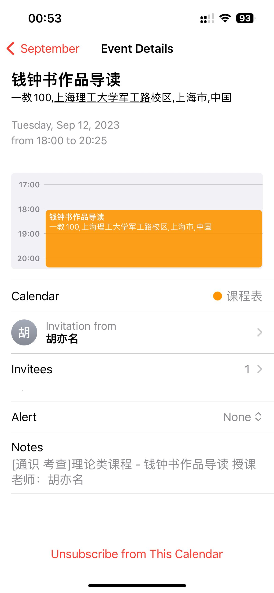
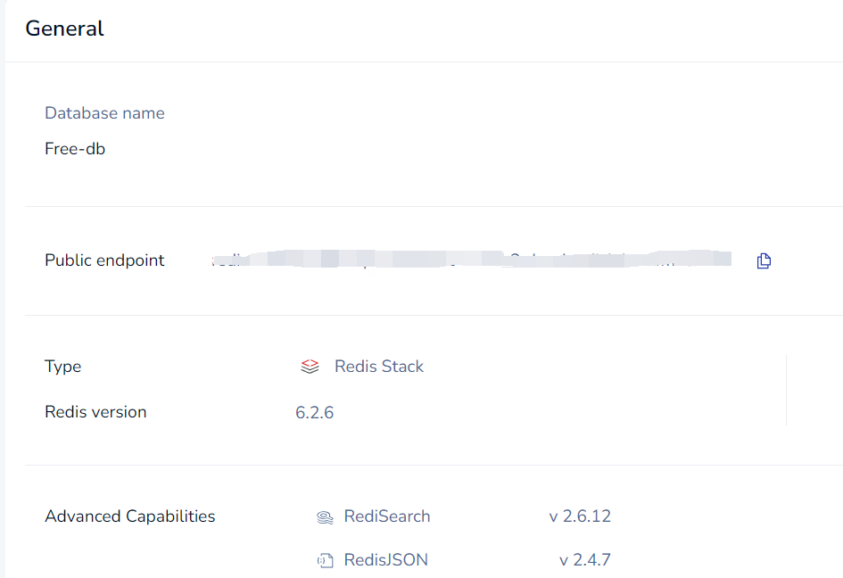
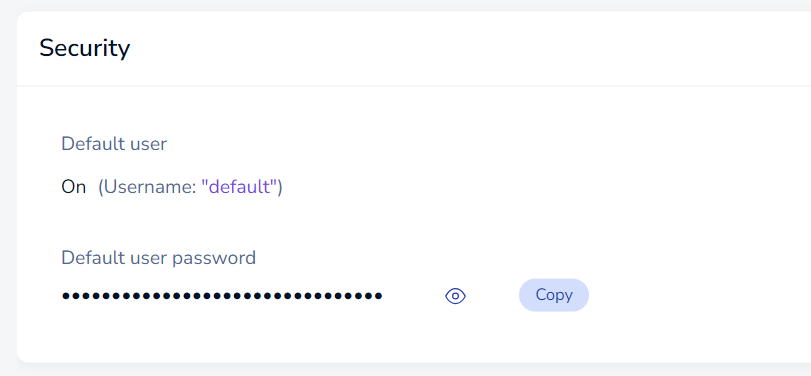
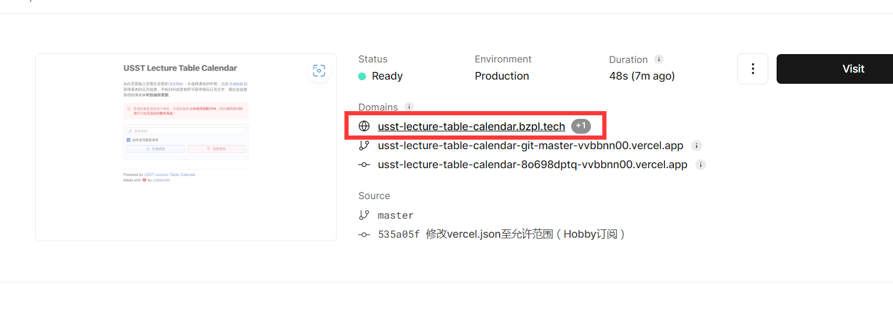

> **Warning**
>
> 该项目**仅适用于**对计算机技术有一定了解的同学，如果你不了解`Node.js`、`Docker`技术，也没有兴趣学习，那么该项目可能不适合您。

> 📝 提示：该项目是一个完全**非官方**、**非商业**的项目，由于本人能力有限，因此无法保证该项目的稳定性和安全性，同时，也**无法提供一对一的技术支持**。如果你对该项目有任何疑问或建议，可以在 [Issues](https://github.com/vvbbnn00/USST-Lecture-Table-Calendar/issues)中提出，不过无法保证及时回复。

## 🤔 这是什么？

这是一个基于`next.js`
的课程表转日历服务程序。该项目可以帮助你将上海理工大学的课程表导入到你的日历中，并时刻保持更新。目前支持导入到`Google Calendar`、`Apple Calendar`、`Outlook Calendar`
等常见互联网日历服务，也可导入至任何支持`.ics`文件格式或支持`URL`
日历订阅的手机/计算机操作系统中。该项目源自于智慧校园建设中的`课程表`小程序的`导出至日历`
功能。由于目前该功能入口已关闭，因此在此将该功能独立出来，方便大家使用。

以下是导入到`Apple Calendar`的效果图：

<div>
    
    
</div>

## 💡 特色

- 🚀 **快速**：支持`Vercel`、`Docker Compose`、`Node.js`等多种部署方式，可快速部署，且部署门槛低。
- 📅 **自动更新**：可按照设定的频率自动更新课程表，无需手动操作。
- 🖥️ **交互界面**：可一键生成日历订阅链接，无需手动复制粘贴；同时也支持手动刷新课程表缓存。
- 🏖️ **调休支持**：时刻获取最新的放假安排，支持放假和调休，可自动调整课表。
- 📚 **多学期支持**：支持多学期课程表，可手动切换学期，也可根据日期自动选择当前学期。
- 📱 **多平台支持**：`.ics`文件格式支持在绝大多数操作系统中导入。
- ⏰ **提醒功能**：可按照设定的时间提前提醒上课，避免错过课程。
- ...

## 🚀 快速上手

### Vercel (推荐，无需服务器，免费)

> 由于国内网络环境，部分地区可能无法访问`Vercel`
> 免费提供的域名，若您有自己的域名，可以根据[官方文档(英文)](https://vercel.com/docs/projects/domains/add-a-domain)
> 进行配置。当然，您也可以选择使用`Docker-compose`部署。

1、由于该项目需要配合`Redis`使用，因此您需要先拥有一个`Redis`服务。此处推荐使用[RedisLabs](https://redislabs.com/)
提供的免费服务，虽然只有30兆空间，但是已经足够使用了。注册后，您可以在`RedisLabs`的控制台中找到您的`Redis`服务的`URL`
和`密码`，如下图所示：

<div>
    
    
</div>

按照上图提供的信息，拼接出`REDIS_URL`，格式如下：

```
redis://default:<password>@<Public endpoint>
```

若您在注册中遇到困难，可以参考[这篇文章(英文)](https://medium.com/swlh/host-and-use-redis-for-free-b70d65a13edd)。

2、点击下方按钮，使用`GitHub`账号登录`Vercel`
，并按照提示完成部署。部署过程中会要求输入环境变量，具体填写方式参照[环境变量](#-环境变量)一节。

[](https://vercel.com/new/clone?repository-url=https://github.com/vvbbnn00/USST-Lecture-Table-Calendar&env=LOGIN_METHOD&env=JWGL_USERNAME&env=JWGL_PASSWORD&env=IDS_USERNAME&env=IDS_PASSWORD&env=SECRET_KEY&env=ENABLE_REMINDER&env=REMINDER_SECONDS&env=COURSE_TABLE_CACHE_TIME&env=REDIS_URL&env=REDIS_PREFIX)

3、等待部署完成，您可以在`Vercel`的控制台中找到您的项目的`域名（Domain）`，如下图所示：
<div>
    
</div>

PS：您也可以自定义您的项目的`域名`，具体操作参照[官方文档(英文)](https://vercel.com/docs/projects/domains/add-a-domain)。

4、Enjoy it! 🎉

### Docker-compose （部署便捷，需要服务器）

以下教程默认您已经安装好了`Docker`和`Docker-compose`
，若您还未安装，可以参考[这篇文章(中文)](https://www.runoob.com/docker/ubuntu-docker-install.html)
或[官方教程(英文)](https://docs.docker.com/engine/install/)进行安装。

1、Clone 该项目到您的服务器上

```bash
git clone https://github.com/vvbbnn00/USST-Lecture-Table-Calendar.git
```

2、进入项目目录，编辑`docker.env`文件配置基础设置，并创建`docker.env.local`文件配置机密设置。具体参照[环境变量](#-环境变量)一节。

3、构建并启动容器（项目将在`3000`端口运行，请确保该端口未被占用且已开放）

```bash
docker-compose up -d
```

4、Enjoy it! 🎉

### Node.js （需要服务器）

以下教程默认您已经安装好了`Node.js`和`npm`
，若您还未安装，可以参考[这篇文章(中文)](https://www.runoob.com/nodejs/nodejs-install-setup.html)。

1、Clone 该项目到您的服务器上

```bash
git clone https://github.com/vvbbnn00/USST-Lecture-Table-Calendar.git
```

2、进入项目目录，安装依赖

```bash
cd USST-Lecture-Table-Calendar
npm install
```

3、新建`.env`文件，配置`docker.env`中出现的所有配置。具体参照[环境变量](#-环境变量)一节。

4、构建项目

```bash
npm run build
```

5、启动项目（项目将在`3000`端口运行，请确保该端口未被占用且已开放）

```bash
npm run start
```

6、Enjoy it! 🎉

## 🌏 环境变量

> 部分环境变量并非必填，但由于`Vercel`
的构建模板要求一定要填写全部环境变量，因此需要麻烦复制粘贴一下默认值。若您使用的是`Docker-compose`或`Node.js`
，则可以根据您的需求选择性填写。

| 环境变量                      | 是否必填                      | 默认值     | 说明                                                                                    |
|---------------------------|---------------------------|---------|---------------------------------------------------------------------------------------|
| `REDIS_URL`               | 是                         | 无       | `Redis`服务的`URL`，格式为`redis://<username>:<password>@<host>:<port>`，具体参照[快速上手](#-快速上手)一节 |
| `SECRET_KEY`              | 是                         | 无       | 用于保护您的课表不被泄露，请牢记该秘钥，在获取日历文件时将会用到                                                      |
| `LOGIN_METHOD`            | 是                         | `jwgl`  | 登录方式，可选值为`ids`或`jwgl`，分别对应`统一身份认证系统`和`教务管理系统`（二者的密码默认是不一样的，请注意区分）                     |
| `JWGL_USERNAME`           | 若`LOGIN_METHOD`为`jwgl`则必填 | 无       | 教务管理系统用户名                                                                             |
| `JWGL_PASSWORD`           | 若`LOGIN_METHOD`为`jwgl`则必填 | 无       | 教务管理系统密码                                                                              |
| `IDS_USERNAME`            | 若`LOGIN_METHOD`为`ids`则必填  | 无       | 统一身份认证系统用户名                                                                           |
| `IDS_PASSWORD`            | 若`LOGIN_METHOD`为`ids`则必填  | 无       | 统一身份认证系统密码                                                                            |
| `ENABLE_REMINDER`         | 否                         | `true`  | 是否启用提醒功能，可选值为`true`或`false`。开启后将在上课前`REMINDER_SECONDS`秒提醒上课                           |
| `REMINDER_SECONDS`        | 否                         | `900`   | 提醒时间，单位为秒，即上课前多少秒提醒上课。默认为`900`，即提前`10`分钟提醒上课。                                         |
| `COURSE_TABLE_CACHE_TIME` | 否                         | `86400` | 课程表缓存时间，单位为秒，即多少秒更新一次课程表。默认为`86400`，即每天更新一次课程表。                                       |
| `REDIS_PREFIX`            | 否                         | `ULTC:` | `Redis`缓存的前缀，用于区分不同的项目，避免冲突。若您同时部署了多个该项目，可以修改该值。                                      |

## 📅 导入日历

相信能够操作到这里的你不会被导入日历这一步难住，因此这里就不再赘述了。如果您不知道如何导入日历，可以参考以下链接：

- [URL订阅日历使用帮助](https://docs.qq.com/doc/DSkpNTlJ4aFlBSmhr)
- [在 iPhone 上设置多个日历](https://support.apple.com/zh-cn/guide/iphone/iph3d1110d4/ios)
- [将日历导入Outlook](https://support.microsoft.com/zh-cn/office/%E5%B0%86%E6%97%A5%E5%8E%86%E5%AF%BC%E5%85%A5-outlook-8e8364e1-400e-4c0f-a573-fe76b5a2d379)
- [How to display iCal calendar events on Google Calendar](https://www.youtube.com/watch?v=LmDo6yt5eYI)

若您的手机原生不支持`URL`订阅日历，通常也能够通过`Outlook`导入后，添加`Outlook`账号到您的手机中，从而实现导入。

如果您还是不知道如何操作，可以先在**各大搜索引擎**中搜索`如何导入URL订阅日历`，然后再搜索`<您的日历服务商> 如何导入URL订阅日历`，比如`华为手机 如何导入URL订阅日历`，相信您一定能找到答案。

如果您经过**仔细的搜索**、**反复尝试**仍然无法导入，那么您可以首先在[Discussions](https://github.com/vvbbnn00/USST-Lecture-Table-Calendar/discussions)中发帖求助网友，或在[Issues](https://github.com/vvbbnn00/USST-Lecture-Table-Calendar/issues)中将您遇到的困难（**请务必详细描述您的问题，最好附带截图**）提交给我，我会尽快回复您。

由于本人能力有限，因此无法保证及时回复。在提问前，请先查看一下[已解决的问题](https://github.com/vvbbnn00/USST-Lecture-Table-Calendar/issues?q=is%3Aissue+is%3Aclosed)中是否有您的问题，避免重复提问，谢谢！